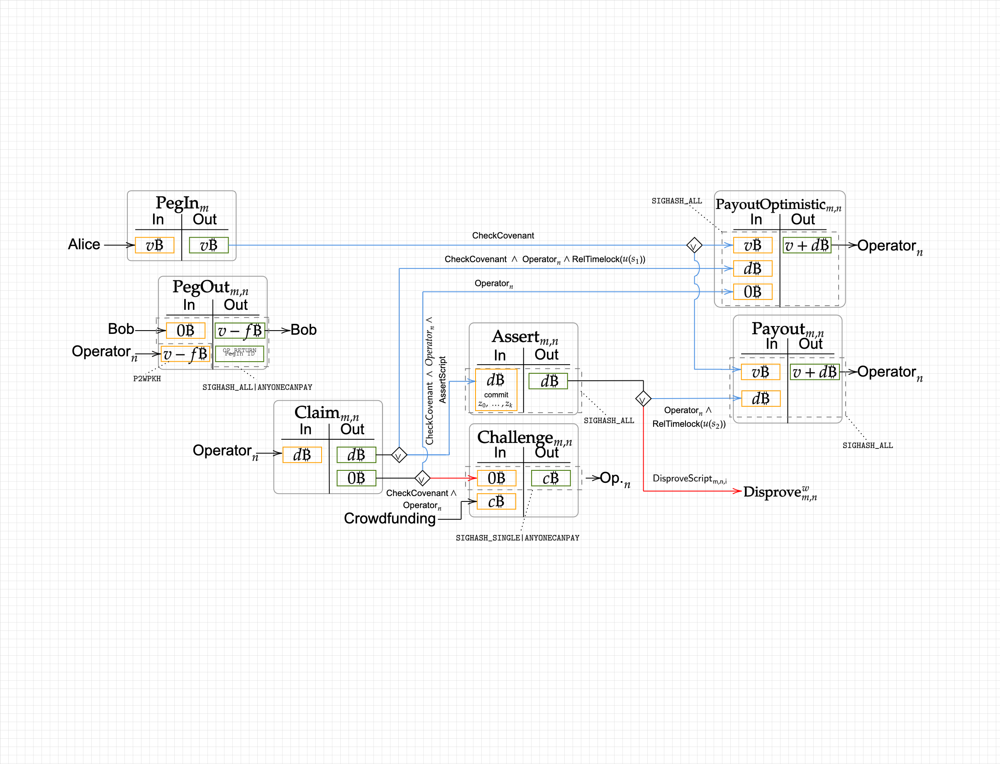

Let's talk about presigning works of covenant committee in BitVM2 bridge:

**How to protect UTXOs through presigning of covenant committee at setup time?**

The security is ensured by the **1-out-of-n** honesty of covenant committee, means that at least one of the covenant committee members must abandon his own `vk` after presigning. Ensuring that new covenant committee signatures for a specific *PegIn* instance will not come out suddenly sometime in the future at runtime (after setup time).

# PegIn

How to protect the the UTXO in *PegIn* with the assumption of **1-out-of-n**?

- Spender must unlock this UTXO through `CheckCovenant` script which includes the `pk` of covenant committee.

In this case, there are two options:

- one of covenant committee presigned `PayoutOptimistic` transactions.
- one of covenant committee presigned `Payout` transactions.

 

# Claim

## First UTXO

How to protect the first UTXO in **Claim** with assumption of **1-out-of-n**?

- Spender unlock this UTXO through `CheckCovenant` script which specified `pk` of covenant committee, and `RelTimelock` script which specified a fixed block number.
  
  - The covenant committee signing message must include the `RelTimelock` script, and `CheckCovenant` script itself.

- Spender unlock this UTXO through `CheckCovenant` script which specified `pk` of covenant committee, and `AssertScript` script which specified a sequence `pk`s of Winternitz signature for all assertions.
  
  - The covenant committee signing message must include the `AssertScript` script, and `CheckCovenant` script itself.

Note that there is a mistake in above diagram. *Assert* transaction must be presigned by covenant committee, otherwise *Assert* can only be issued by any transaction which includes `AssertScript`.

In this case, there are two options:

- one of covenant committee presigned `PayoutOptimistic` transacitons.
- one of covenant committee presigned `Assert` transactions.

## Second UTXO

How to protect the second UTXO (dust amount) in Claim with assumption of **1-out-of-n**?

- Spender unlock this UTXO through `Operator` script which specified the `pk` of operator.

- Spender unlock this UTXO through `CheckCovenant` script which specified the `pk` of covenant committee and `Operator` script which specified the `pk` of operator. 
  
  - The covenant committee signing message must include the `Operator` script and `CheckCovenant` script itself.

Note that there is mistake in above diagram. *Challenge* transaction must be prsigned by covenant committee, otherwise *Challenge* can only be issued by operator hisself, this is not rantional for operator.

In this case, there are three options:

- ~~Any transaction signed and issued by operator hisself.~~ An rational operator has no reason to do this, since operator won't get the paied money `c` from challenger in unhappy case and happy case is blocked.
- One of covenant committee presigned *PayoutOptimistic* transaction for each operator.
- One of covenant committee presigned *Challenge* transaction for each operator.

# Assert

How to protect the UTXO in *Assert* transaction with assumption of **1-out-of-n**?

- Spender unlock this UTXO through `Operator` script which specified the `pk` of operator, and `Reltimelock` script which specified a fixed block number.

- Spender unlock this UTXO through `DisproveScript_i` script which specified a few  `pk`s of Winternitz signature for disprove.

Note that there is a mistake in above diagram. The second input of *Payout* transaction do not have to be presigned by covenant committee. 

In this case, there are three options:

- ~~Any transaction including `Operator` and `Reltimelock` script issued by operator.~~  An rational operator has no reason to do this, since operator can not take the UTXO from *PegIn* transaction in this case.

- Anyone want to disprove with `DisproveScript_i`.

- One of covenant committee presigned *Payout* transaction for each operator.

So the final transaction graph of BitVM2 bridge comes:
