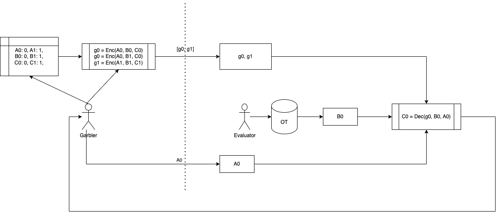

In setup phase Garbler's task is to:
- maintain all map relations between preimages and committed labels, such as $A_0 \rightarrow 0$.
- maintain all garble table entries, and share all encoded garbled entries with evaluator, such as $g_0 = Enc(A_0, B_0, C_0)$.

In runtime phase:
- garbler send any label he want to share to evaluator $A_0$.
- evaluator applies decoding algorithm $C_0 = Dec(A_0, B_0, g0)$ to get output label $C_0$.
- evaluator send output label $C_0$ to garbler, then garbler can decode it to its preimage $0$.