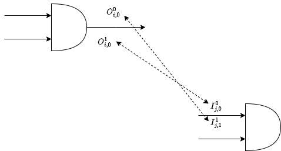

## Notation

- $[a]$ denotes a commitment of a message $a$.
- $H(a)$ denotes hash of a message $a$.

## XOR-Homomorphic Commitment

Goal: 

> Given two commitments $[a], [b]$, and $c = a \oplus b$, where $\oplus$ is xor operator. We have:
> 
> $$
> [a] \oplus [b] = [c] = [a \oplus b]
> $$

How about hash-based commitment? It won't work:

$$
H(a) \oplus H(b) \ne H(a \oplus b)
$$

since hash does not have the linearity propterty.

Referring [this paper](https://eprint.iacr.org/2015/694.pdf), we have a simpler versioned XOR-homomorphic commitment. Assuming the bit lenght of message need to committed is fixed, say $a, b, c \in \{0, 1\}^n$. There is randomly generated bit matrix which is shared between prover and verifier, $A \in \{0, 1\}^{n \times m}$.

#### Commit

Garbler randomly generate a secret $r_a \in \{0, 1\}^m$, then map it to a vector $t_a \in \{0, 1\}^n$ in *bit-wise* through matrix $A$:

$$
t = A \cdot r_a
$$

then xor it with message $a$ in *bit-wise*:

$$
[a] = t_a \oplus a = a \oplus (A \cdot r_a)
$$

Similarily we have a commitment for message $b$:

$$
[b] = b \oplus (A \cdot r_b)
$$

Let's take a look at how does the first bit of commitment $[a]$ look like:

$$
[a] _0 = a_0 \oplus t_0 = a_0 \oplus \cup_{\oplus}(A_{0, i} \land r_{a_i})
$$

observing that each bit is encoded with some randomness which retains a linearity property owned by XOR operator.

Similarily we have:

$$
[b]_0 = b_0 \oplus \cup_{\oplus}(A_{0, i} \land r_{b_i})
$$

#### Check

Garbler reveals (sends) $c = a \oplus b$ along with its secret $r_c = r_a \oplus r_b$ to evaluator, then evalutor checks:

$$
[c] \overset{?}= [a] \oplus [b]
$$

Let's also take a look at the first bit of commitment $[c]$ for example:

$$
\begin{aligned}
[c]_0 &= (a_0 \oplus b_0) \oplus \cup_{\oplus} (A_{0, i} \land r_{c_i}) \\
&= (a_0 \oplus b_0) \oplus \cup_{\oplus} (A_{0, i} \land (r_{a_i} \oplus r_{b_i}))  \\
&= (a_0 \oplus b_0) \oplus \cup_{\oplus} (A_{0, i} \land r_{a_i}) \oplus \cup_{\oplus} (A_{0, i} \land r_{b_i}) \\
&= (a_0 \oplus \cup_{\oplus} (A_{0, i} \land r_{a_i})) \oplus (b_0 \oplus \cup_{\oplus} (A_{0, i} \land r_{b_i})) \\
&= [a]_0 \oplus [b]_0
\end{aligned}
$$

That's what we expected! XOR-homomorphic commitment does not reveal anything related with message $a, b$.

Note that randomness for XOR-homomorphic commitment can not be leaked anyway, otherwise message will be leaked. 

## Soldering

Goal:

> Garbler has two pair wire labels, $(O_{i, 0}^0, O_{i, 0}^1)$ and $(I_{j, 0}^0, I_{j, 0}^1)$, which belongs to $0$-th output wire of componant $i$ and $0$-th input wire of componant $j$ respectively. Garbler needs to prove to evaluator that they are bound together, this is called soldering.

In the setting of free-XOR garbled circuits, garbler has a global key offset $\Delta$ applied for every labels in a component GC. For example in component $i$, we have:

$$
O_{i, 0}^1 = O_{i, 0}^0 + \Delta_i
$$

similarily in component $j$, we also have:

$$
I_{j, 0}^1 = I_{j, 0}^0 + \Delta_j
$$

Therefore, both key offsets $\Delta_i$ and $\Delta_j$ are hold by garbler privately, and can not be leaked anyway. $O_i^0$ and $I_j^0$ are what we called *zero-key*s.

Another concept we need to address here is *indicator bit*  or *permutation bit* for each wire of a component GC, for example $\sigma_{i, 0}, \sigma_{j, 0}$, actually this bit is encoded within *zero-key* $O_{i, 0}^0$ or $I_{j, 0}^0$. It permutes the order the committed keys, ensuring that the committed keys $([K_i^0], [K_i^1])$ does not reveal the wire bit value under the hood.

#### Commit Phase

In setup time, garbler need to commit below things:

|             | Zero-key     | Key Offset | Indicator       |
| ----------- | ------------ | ---------- | --------------- |
| Output Wire | $O_{i, 0}^0$ | $\Delta_i$ | $\sigma_{i, 0}$ |
| Input Wire  | $I_{j, 0}^0$ | $\Delta_j$ | $\sigma_{j, 0}$ |

So evaluator will receive:

- zero-key  $[O_{i, 0}^0]$ of output wire in component $i$.

- zero-key $[I_{j, 0}^0]$ of input wire in component $j$.

- key offset $\Delta_i$ of component $i$.

- key offset $\Delta_j$ of component $j$.

Note that wire indicator is encoded in zero-key explicitly, so it keeps private until garbler actively reveal it corresponding zero-key.

#### Reveal Phase

Garbler reveals:

- $S^\sigma = \sigma_{i, 0} \oplus \sigma_{j, 0}$ difference of two indicator bits.

- $S^K = O_{i, 0}^0 \oplus I_{j, 0}^0 \oplus (S^\sigma \cdot \Delta_j)$ difference of two zero-keys.

- $S^\Delta = \Delta_i \oplus \Delta_j$ difference of two key offsets. 

with evaluator. Note that, beside above three variables, garbler also needs to send randomness XOR-commitment for $S^K$ and $S^\Delta$. 

#### Verify Phase

Garbler has the following check equation in principle:

$$
I_{j, 0}^b = O_{i, 0}^b \oplus S^K \oplus (b \cdot S^\Delta)
$$

evaluator needs to check this equation with the three variables garbler sended. But before that, evaluator must ensure $S^\sigma, S^K, S^\Delta$ which are sent by garbler are correct. 

So two steps in general:

- check correctness of $S^\sigma, S^K, S^\Delta$:
  
  - $[S^k] \overset{?}= [O_{i, 0}^0] \oplus [I_{j, 0}^0] \oplus (S^\sigma \cdot [\Delta_j])$
  
  - $[S^\Delta] \overset{?}= [\Delta_i] \oplus [\Delta_j]$

- if passed, then check:
  
  - $I_{j, 0}^b \overset{?}= O_{i, 0}^b \oplus S^K \oplus (b \cdot S^\Delta)$
    
    where $b \in \{0, 1\}$.

## References
[1] [On the Complexity of Additively Homomorphic UC Commitments](https://eprint.iacr.org/2015/694.pdf)

[2] [LEGO for Two Party Secure Computation](https://eprint.iacr.org/2008/427.pdf)

[3] [Secure Two-Party Computation with Reusable
Bit-Commitments](https://eprint.iacr.org/2013/577.pdf)
