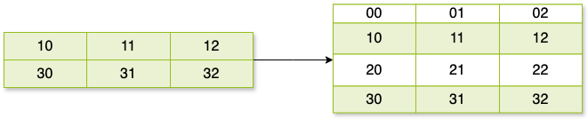

# Basic Concepts

## Information

Information means uncertainity of a specific **event** (such as $P(X = x_0)$). How to measure it anyway? The information function

$$
f(x) = - \log x
$$

describes relation between **probability** ($x$-axis) and **information** ($y$=axis). It must satisfy two properties:

- it is a decreasing function within range $(0, 1]$, where $f(0) \approx +\infty$ , $f(1) = 0$.

- it satisfy addition law, $f(x \cdot y) = f(x) + f(y)$

For example given a specific **event probability** $P(X = x_0) = 1/4$, then the information is measured:

$$
f(P(X = x_0)) = - P(X = x_0) \cdot \log P(X = x_0) = - \frac{1}{4} \cdot \log \frac{1}{4} = \frac{1}{2}
$$

## 

## Entropy

Entropy means **expected** information, or **expected** uncertainity of an event $X$ with specified **probability distribution**. 

For example given a probability distribution of an event $X$, say:

| $X = x_i$    | $x_0$ | $x_1$ | $x_2$ | $x_3$ |
| ------------ | ----- | ----- | ----- | ----- |
| $P(X = x_i)$ | 1/4   | 0     | 1/2   | 1/4   |

Then the entropy (expected information) of event $X$ with some probability distribution $P(X = x_i)$ is:

$$
H(X) = -(2 \cdot \frac{1}{4} \cdot \log \frac{1}{4} + \frac{1}{2} \cdot \log \frac{1}{2}) = \frac{3}{2}
$$

## 

## Conditional Entropy

Conditional entropy means expected information of an event $Y$ knowing event $X$, where $Y$ is output event, $X$ is input event:

$$
\begin{aligned}
H(Y|X) &= \sum_{i} p_i \cdot H(Y|X = x_i) \\
&= \sum_{i} p_i \cdot \sum_{j} - p_{i, j} \cdot \log p_{i, j}
\end{aligned}
$$

For example, there is conditional probability matrix:

$$
p_{ij} = 
\begin{pmatrix} 
3/4 & 0 & 1/4 \\
0 & 1/2 & 1/2 \\
\end{pmatrix}
$$

assuming the input event $X$ probability distribution is $P(X = 0) = P(X = 1) = 1/2$, then the conditional entropy $H(Y|X) = - \frac{1}{2} \cdot (\frac{3}{4} \log \frac{3}{4} + \frac{1}{4} \log \frac{1}{4} + 2 \cdot \frac{1}{2} \log \frac{1}{2})$.

## Joint Entropy

Joint entropy means expected information gained from both input event $X$ (or $Y$) and output event $Y$ (or $X$):

$$
H(X, Y) = H(X) + H(Y|X) = H(Y) + H(X|Y)
$$

## Mutual Information

Mutual information measures information of output event $Y$ conveyed by input event $X$, or vice versa:

$$
I(X, Y) = H(Y) - H(Y|X) = H(X) - H(X|Y)
$$

Note that, **mutual information is not entropy**, it's the gap between the information of output event $Y$ and the information of output event $Y$ knowing input event $X$!

For example, according to above conditional probability matrix $p_{ij}$, the output event $Y$ probability is $P(Y = 0) = 3/8, P(Y = 1) = 1/4, P(Y = *) = 3/8$ . Then information of output event $H(Y) = - 2 \cdot \frac{3}{8} \log \frac{3}{8} - \frac{1}{4} \log \frac{1}{4}$. The mutual information can be calculated with:

$$
I(X, Y) = H(Y) - H(Y|X)
$$

But why this gap exists anyway? I think this is the meaning of information theory...

# Advanced Concepts

## Maximum Likelihood Decoding

The probability of correct decoding is:

$$
P_{COR} = \sum_{j} q_j \cdot q_{\Delta(j)j}
$$

where

$$
q_{\Delta(j)j} = P(X = s_{\Delta(j)} | Y = t_j)
$$

$P_{COR}$  is the expected probability of decoding a receiving word $v = t_j$ correctly, i.e. $s_{\Delta(j)} = u$, where $u$ is the actual sending word corresponded with receiving word $v$. Applying **Maximum Likelihood Decoding** we can easily get to know which $\Delta(j)$ points to? $p_{\Delta(j)j} \ge p_{ij}$.

For example, sending word $u \in S = \{0, 1\}^1$, receiving word $v \in T = \{0, 1, *\}^1$, have the following map:

According to **Maximum Likelihood Decoding**, if we decode $v = 0$ to $\Delta(v = 0) = 0$, then we say this decoding is correct. Similarly if we decode $v = 1$ to $\Delta(v = 1) = 1$, and decode $v = *$ to $\Delta(v = *) = 1$, then we say these decodings are correct.

The expected probability of correct **Maximum Likelihood Decoding** for any receiving word $v$ can be calculated if we know the distribution of $Y$ (for example $p(Y = 0, 1, *) = 3/8, 1/4, 3/8$), or $X$ :

$$
P_{COR} = \sum_{j} q_j \cdot q_{\Delta(j)j} = 3/8 * 1 + 1/4 * 1 + 3/8 * 2/3 = 7/8
$$

 

## Transmision Rate

Few definitions:

- a **symbol** is denoted as $s_i$.

- a **symbol** set with size $r$ is denoted as $A = \{s_0, s_1, ..., s_r\}$.

- A code with $n$ symbols, $C$ which is  constructed through a symbol set $A$, is a subset of $A^n$. i.e. $C \subset A^n$.

Transmision **Rate** is defined as:

$$
R = \frac{\log_r |C|}{n}
$$

Observing that **Rate** is not relevant with **Channel**, it is a characteristic of **Code**. More importantly, Code is a particular subset (subgroup) of whole code space, and it has many interesting and critical properties.

## Capacity

Given a **Channel** $\Gamma$ (fixed conditional distribution):

$$
\Lambda = \max I(X, Y)
$$

maximising over all input and output probability distributions $p_i$ and $q_j$, we get the **capacity** of a channel.

$$
\max I(X, Y) = \max_{X \backsim D_X} H(X) - H(X|Y) = \max_{Y \backsim D_Y} H(Y) - H(Y|X)
$$

Obverving that **Capacity** is a characteristic of a specific channel.

More specially, **capacity** of binary symmetric channel (**BSC**) is:

$$
\Gamma_b = 1 + \phi \cdot \log \phi + (1 - \phi) \cdot \log (1 - \phi)
$$

where $\phi$ denotes the probability that a symbol does not change through this channel.

|     | 0          | 1          |
| --- | ---------- | ---------- |
| 0   | $\phi$     | $1 - \phi$ |
| 1   | $1 - \phi$ | $\phi$     |

# Shannon Theorem

## Lemma 1.11

For $0 < \lambda \le \frac{1}{2}$,

$$
\sum_{i = 0}^{\lfloor \lambda \cdot n \rfloor} \binom{n}{i} \le 2^{n \cdot h(\lambda)}
$$

#### Proof

According to binomial theorem, we have:

$$
\begin{aligned}
1 &= (\lambda + 1 - \lambda)^n \\\
&= \sum_{i = 0}^n \binom{n}{i} \lambda^i \cdot (1 - \lambda)^{(n - i)} \\\
&= \sum_{i = 0}^n \binom{n}{i} (\frac{\lambda}{1 - \lambda})^i \cdot (1 - \lambda)^n \\\
&\ge \sum_{i = 0}^{\lfloor \lambda \cdot n \rfloor} \binom{n}{i} (\frac{\lambda}{1 - \lambda})^i \cdot (1 - \lambda)^n \\\
&\ge \sum_{i = 0}^{\lfloor \lambda \cdot n \rfloor} \binom{n}{i} (\frac{\lambda}{1 - \lambda})^{\lambda \cdot n} \cdot (1 - \lambda)^n
\end{aligned}
$$

equally $\sum_{i = 0}^{\lfloor \lambda \cdot n \rfloor} \binom{n}{i} \le (\frac{\lambda}{1 - \lambda})^{-\lambda \cdot n} \cdot (1 - \lambda)^{-n} = \lambda^{-\lambda \cdot n} \cdot (1 - \lambda)^{- (1 - \lambda) \cdot n}$. Since $\lambda^{-\lambda \cdot n} = 2^{-n \cdot \lambda \log_2{\lambda}}$, then we have:

$$
\sum_{i = 0}^{\lfloor \lambda \cdot n \rfloor} \binom{n}{i} \le 2^{n \cdot (-\lambda \log_2{\lambda} - (1 - \lambda) \log_2{(1 - \lambda)}))} = 2^{n \cdot h(\lambda)}
$$

## Theorem 1.12