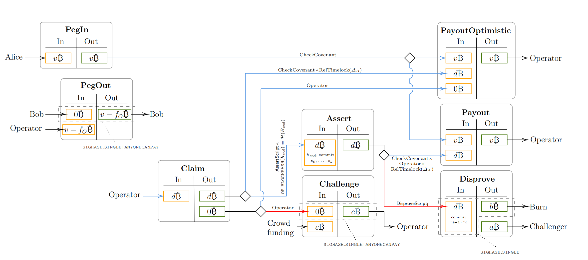
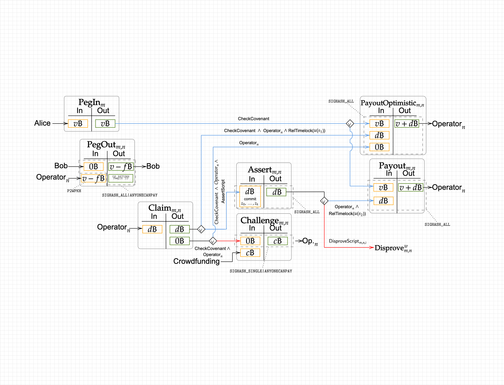

Let's talk about presigning works of covenant committee in BitVM2 bridge:

**How to protect UTXOs through presigning of covenant committee at setup time?**

The security is ensured by the **1-out-of-n** honesty of covenant committee, means that at least one of the covenant committee members must abandon his own `vk` after presigning. Ensuring that new covenant committee signatures for a specific *PegIn* instance will not come out suddenly sometime in the future at runtime (after setup time).

# Signatures

- If multiple users want to sign the same input of a transaction (Multi-sig)
  
  - the `HashType` must be the same, otherwise miner won't pack this kind of transaction.
  
  - the preimages, i.e. index, **prevouts**, **tapleaf**, and transaction content, are the same.
  
  - signatures are different only because `vk` are different.

- If a user want to sign multiple inputs of a transaction
  
  - the `HashType` may be different, in this case prevouts may also be different.
  
  - the preimages must be different, since index is different. And tapleaf may be different.

 

# PegIn

How to protect the the UTXO in *PegIn* with the assumption of **1-out-of-n**?

- Spender must unlock this UTXO through `CheckCovenant` script which includes the `pk` of covenant committee.

In this case, there are two options for spender:

- one of covenant committee presigned `PayoutOptimistic` transactions.
- one of covenant committee presigned `Payout` transactions.

 

# Claim

## First UTXO

How to protect the first UTXO in **Claim** with assumption of **1-out-of-n**?

- Spender unlock this UTXO through `CheckCovenant` script which specified `pk` of covenant committee, `CheckOperator` which specified `pk` of operator, and  `RelTimelock` script which specified a fixed block number.

- Spender unlock this UTXO through `CheckCovenant` script which specified `pk` of covenant committee, `CheckOperator`which specified`pk` of operator, and `AssertScript` script which specified a sequence `pk`s of Winternitz signature for all assertions.

Note that there is a mistake in above diagram. *Assert* transaction must be presigned by covenant committee, and operator, otherwise the `Claim` UTXO can be taken by any transaction which includes `AssertScript`.

In this case, there are two options for spender:

- one of covenant committee presigned `PayoutOptimistic` transacitons.
- one of covenant committee presigned `Assert` transactions.

 

## Second UTXO

How to protect the second UTXO (dust amount) in Claim with assumption of **1-out-of-n**?

- Spender unlock this UTXO through `Operator` script which specified the `pk` of operator.

- Spender unlock this UTXO through `CheckCovenant` script which specified the `pk` of covenant committee and `Operator` script which specified the `pk` of operator. 

Note that there is a mistake in above diagram. *Challenge* transaction must be prsigned by covenant committee, otherwise challenger can not contruct a transaction with operator's signature to spend this UTXO. 

In this case, there are three options for spender:

- ~~Any transaction signed and issued by operator hisself.~~ An rational operator has no reason to do this, since operator won't get the paid money `c` from challenger in unhappy case and happy case is also blocked.
- One of covenant committee presigned *PayoutOptimistic* transaction for each operator.
- One of covenant committee presigned *Challenge* transaction for each operator.

There is problem here, why we need the operator's signature? Since covenant's signature already ensures challenger must use covenant presigned `Challenge` tx to spend the claim UTXO, and the output of `Challenge` tx goes to operator's wallet. All these are build on the trust of covenant committee. Let's me specific more the **trust**, I think it should contains two aspects:

1. believe the transactions presigned by covenant are valid, every transaction pushed by operator are signed.
2. believe at lest one of covenant committee member would abundant its `vk` after signing.

For the satety of `PegIn` UTXO `2)` is enough. But for other UTXOs, such as `Claim`, `Assert`, `Challenge`, `2)` is not enough, user (operator) can not solely depends on the trust of covenant, adding operator himself signature is a good business decision after all. **In conclusion, we can say to operators: for the safety of `PegIn` money you have to trust covenant, but for the safety of `Claim` money you do not have to trust anyone.**

# Assert

How to protect the UTXO in *Assert* transaction with assumption of **1-out-of-n**?

- Spender unlock this UTXO through `Operator` script which specified the `pk` of operator, and `Reltimelock` script which specified a fixed block number.

- Spender unlock this UTXO through `DisproveScript_i` script which specified a few  `pk`s of Winternitz signature for disprove.

Note that there is a mistake in above diagram. The second input of *Payout* transaction do not have to be presigned by covenant committee. 

In this case, there are three options for spender:

- ~~Any transaction including `Operator` and `Reltimelock` script issued by operator.~~  An rational operator has no reason to do this, since if he did then he can not take the UTXO from *PegIn* transaction.

- Anyone want to disprove with `DisproveScript_i`.

- One of covenant committee presigned *Payout* transaction for each operator.

# Modified Design

